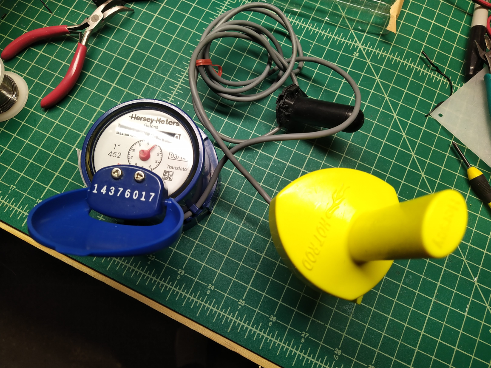

# muellerhotrod

This repo is to document decoding the transmission from a Mueller Hot Rod Radio Transmission Unit.

## Technical info

Model #: AHRHIV1-DL\
FCC ID: SM6-HOTRODV1HI\
Transmit Frequency: 902 - 928 MHz\
Modulation: GFSK\
Tranmission Time: 2.5ms every 3 seconds\
MCU: PIC16F886\
Radio: CC1050

## Decoding with RTL_433

You may have to adjust the gain setting.

```
rtl_433 -f 909M -s 1M -R 0 -X 'preamble={20}aaaaa,n=hotrod,m=FSK_PCM,s=20,l=20,r=3000' -g 20
```
```
_ _ _ _ _ _ _ _ _ _ _ _ _ _ _ _ _ _ _ _ _ _ _ _ _ _ _ _ _ _ _ _ _ _ _ _ _ _ _ _ _ _ _ _  
time      : 2021-02-28 14:34:12
model     : hotrod       count     : 1             num_rows  : 1             rows      : 
len       : 92           data      : feb10014376017005053000
codes     : {92}feb10014376017005053000
```

## Recorded sample

```
hotrod_g001_909M_1000k.cu8
```

## Data format

```
?? ?? TT TT TT TT TT CC CC CC ?? ?
fe b1 00 14 37 60 17 00 50 53 00 0
```

TT - Meter ID / Translator\
CC - Consumption

The above is meter ID: **0014376017** and consumption: **005053**. The values are base 10, they don't need to be converted from hex. I'm not sure of the other values in the transmission and the Hot Rod v2 appears to encode the data differently.

The Hot Rod transmits it's own ID if the device disconnected from the meter. The printed ID on the device is **2073629812**.
```
fe b1 c0 73 62 98 13 bb 00 00 00 2c
```

## Photos




## TODO

- See if there is a CRC
- Figure out the other bytes
- Decode v2 of the MTU
